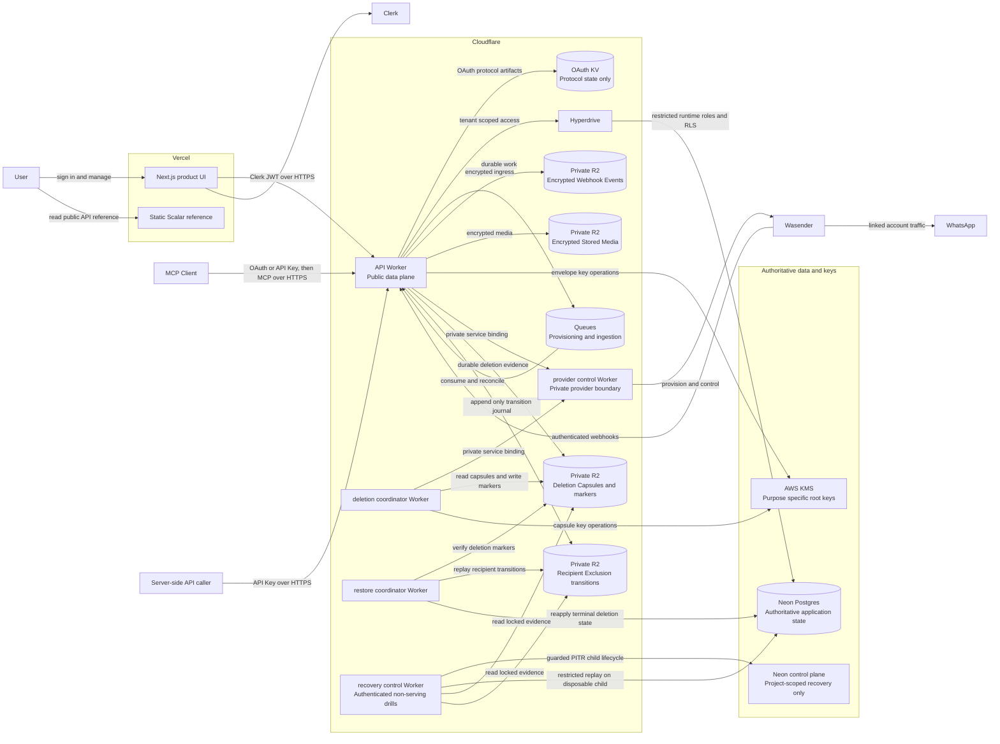

# Architecture

This diagram shows the production boundaries and primary data flows. It is a
map of responsibilities, not a substitute for the detailed contracts, ADRs,
and runbooks.

## Boundary notes

* The API Worker is the only public data plane. Browser requests go directly to
  its configured origin. Server-side automations call the same Worker with a
  User-created API Key; they do not go through Vercel or a second public Worker.
  The static Scalar app at `docs.normal.fast` is a separate Vercel project. It
  renders the generated OpenAPI document and cannot execute authenticated
  requests, persist an API Key, or proxy browser data requests to the API
  Worker. Development and preview use isolated docs projects and hostnames.
* `provider-control` is private. Provider API Credentials and provider specific
  behavior do not cross its boundary or the `packages/wasender` seam.
* `recovery-control` is public only on its dedicated custom domain for the
  protected GitHub recovery environment. A constant-time bearer check precedes
  its closed start/status contract, a Durable Object serializes runs, and a
  Workflow reconciles an exact annotated non-serving Neon PITR child. It can
  read locked markers and Recipient Exclusion transitions, but it has no Stored
  Media or Webhook Ingress binding and therefore simulates and acknowledges
  child-branch deletion intents without deleting shared production objects.
  Completion requires a separate authenticated evidence authority; missing
  verifier or observability inputs fail the drill closed.
* Neon is authoritative for identity mappings, tenant data, authorization,
  quota reservations, audit records, and lifecycle state. KV, R2, and Queues do
  not become alternate authorities.
* Stored Messages and Stored Media use application layer envelope encryption.
  KMS keys are purpose specific, and the deletion coordinator cannot decrypt
  tenant content.
* Connection Deletion revokes access and key use immediately, including API
  Key selection for that WhatsApp Connection and automatic revocation of a key
  that loses its last selected Connection. The deletion and restore
  coordinators preserve that terminal state through provider cleanup and
  database restore. Disconnection keeps retained-history API Key access.
* A WhatsApp Recipient Exclusion is a User-owned rule enforced beneath every
  MCP Authorization and API Key. Neon holds current state; a locked,
  restore-external R2 journal holds the append-only transitions and permanent
  purge cutoffs the restore coordinator replays before traffic reopens.
* API Keys authenticate REST and compatible MCP Clients through a
  purpose-specific HMAC digest and a narrow Neon bootstrap. API Key-shaped MCP
  credentials route before OAuth and never fall back to OAuth after failure.
  Personal Account Deletion revokes every API Key and clears
  every digest in the same prepare transaction as MCP revocation; active rows
  later cascade during the bounded Personal Account purge. MCP and REST remain
  separate protocol adapters over shared protected WhatsApp operations, quotas,
  and Activity Logs. Activity Log channel is independent from principal type.
  Send Operations admit a protocol-neutral grant identity so MCP Authorization
  and API Key stay distinct principals across both adapters. REST pages complete
  retained Stored Messages at
  `GET /v1/connections/{connection_id}/conversations/{conversation_id}/messages`
  and creates or exactly replays a text Send Operation at
  `POST /v1/connections/{connection_id}/send-operations`. Local Send Status is
  available only to the originating still-active API Key at
  `GET /v1/connections/{connection_id}/send-operations/{send_operation_id}`.

For exact behavior, read [`CONTEXT.md`](../CONTEXT.md), the
[MCP contract](mcp-contract.md), the [configuration reference](configuration.md),
the [Wasender seam](wasender-seam.md), and the [ADRs](adr).
